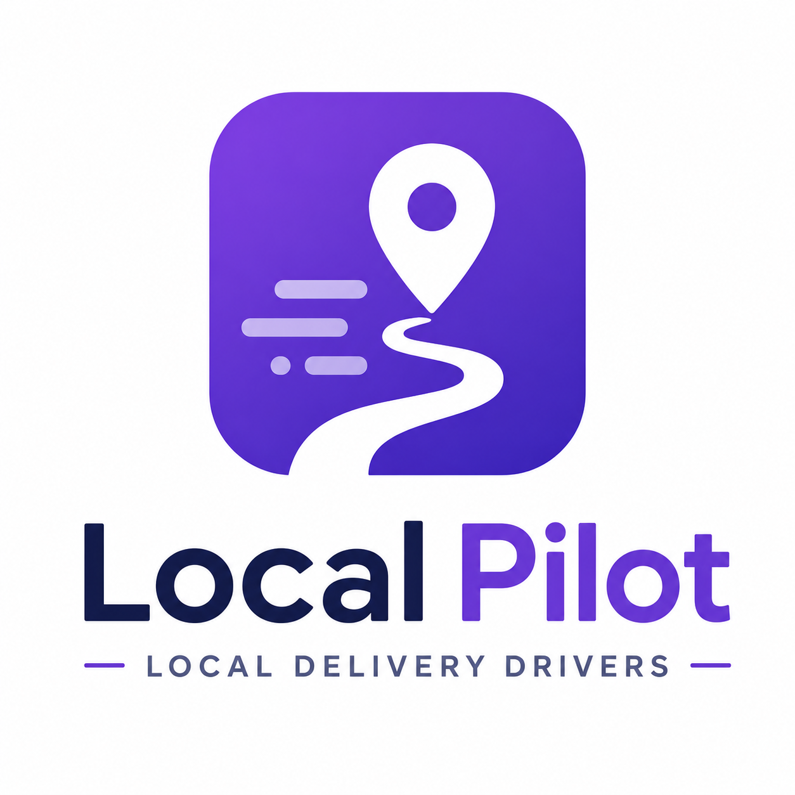
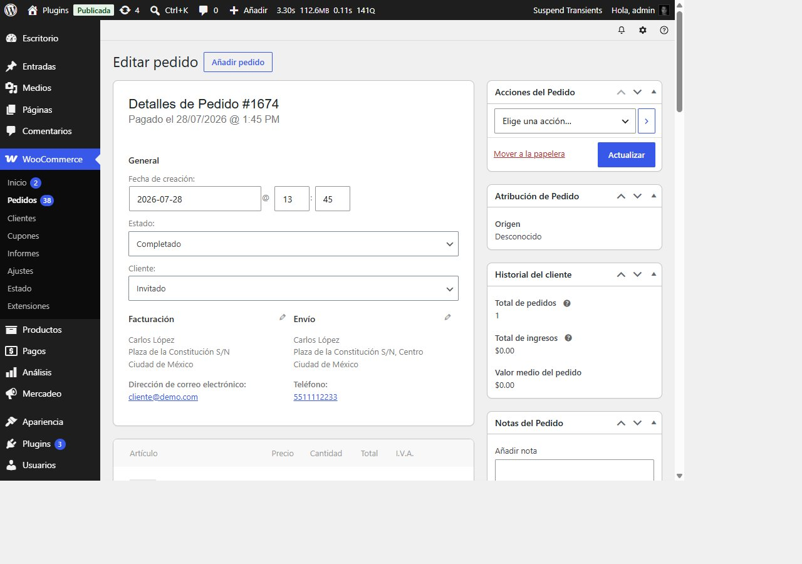
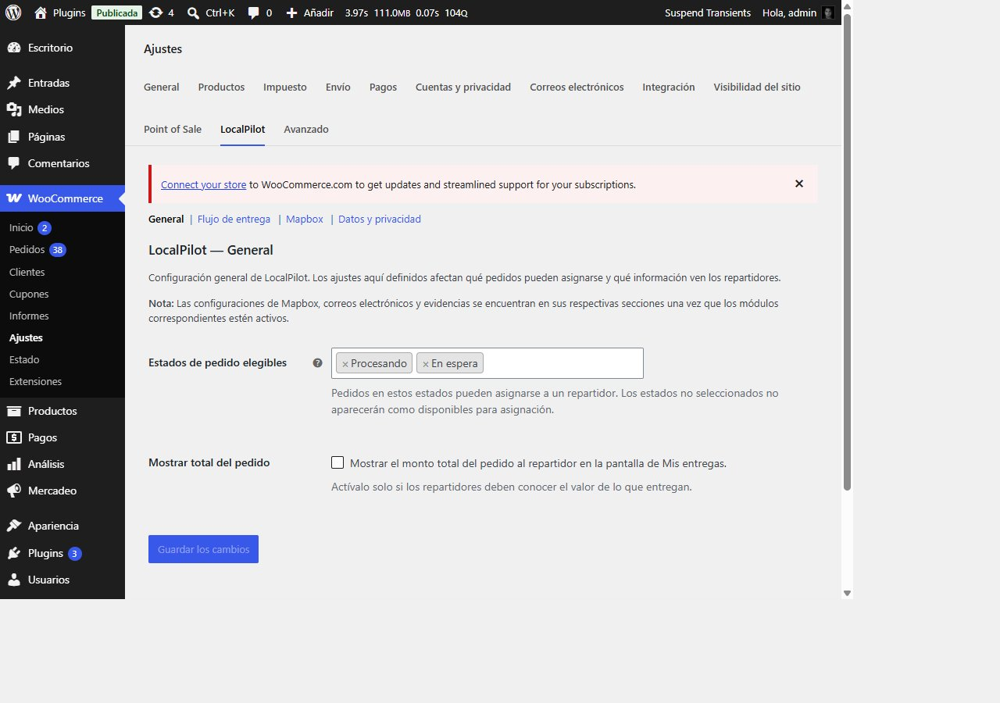
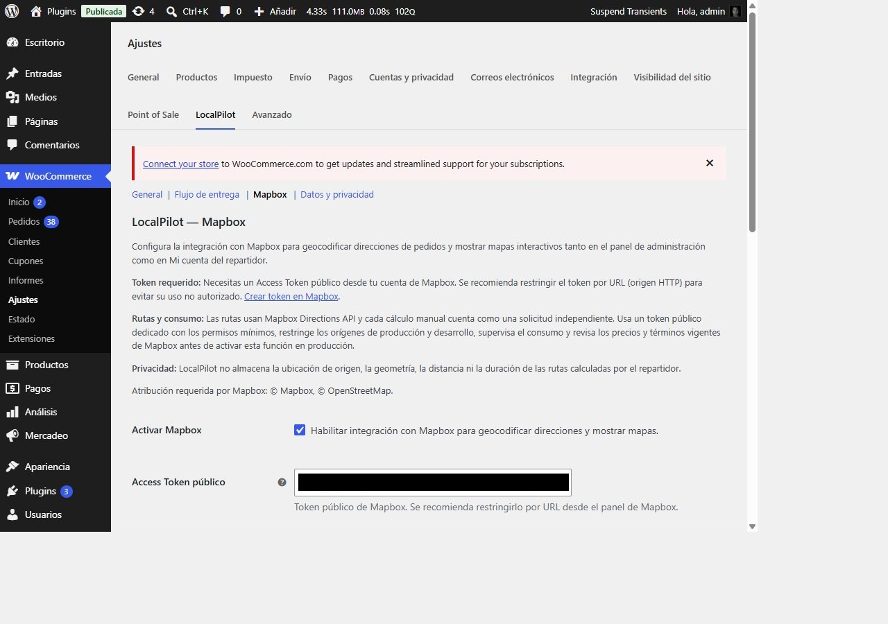
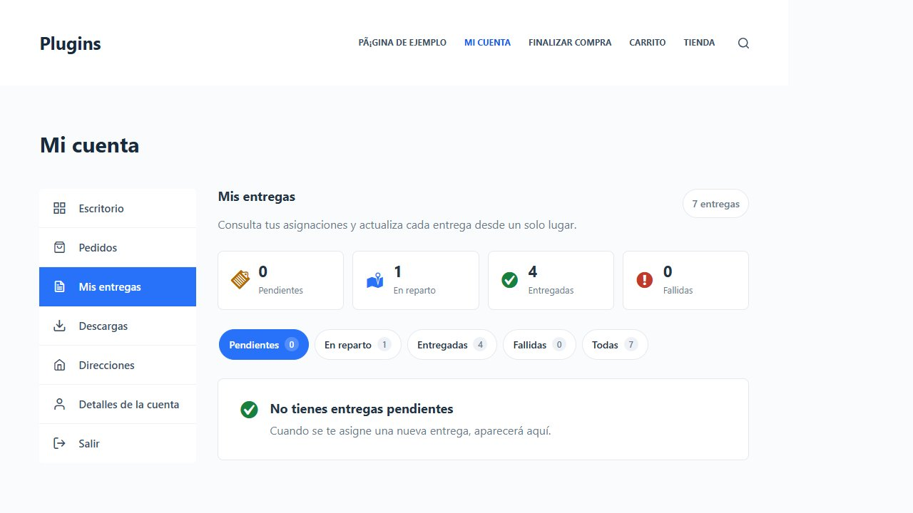
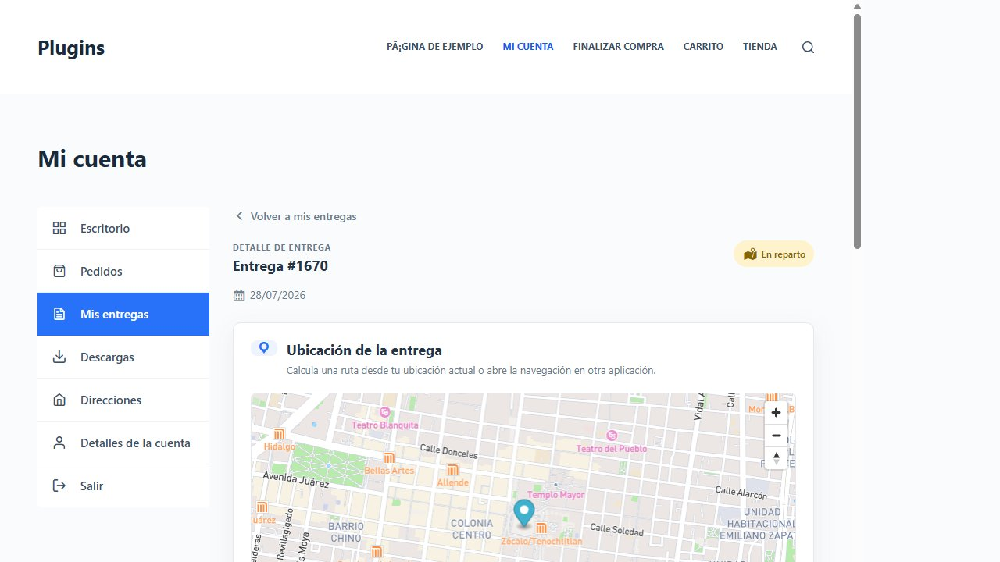
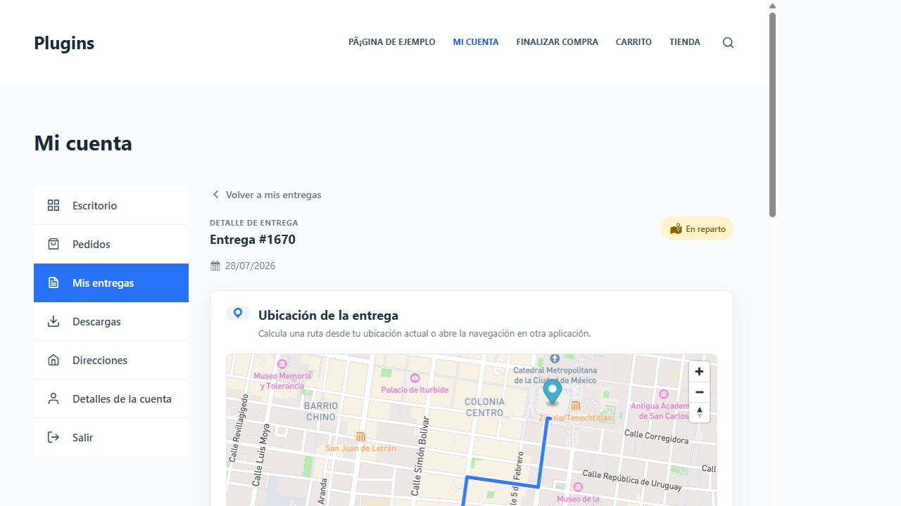

<div align="center">
  
  <h1 align="center">LocalPilot</h1>
  <p align="center">
    <strong>Local Delivery Drivers for WooCommerce</strong>
    <br>
    Connect your WooCommerce store with local drivers.
  </p>
  <p>
    
    
    
    
  </p>
  <p>
    <a href="README.md">�🇸 English</a> · <a href="README.en.md">🇪🇸 Español</a>
  </p>
</div>

---

## 📋 Description

**LocalPilot** adds drivers to WooCommerce. Orders are assigned from the admin panel, and drivers operate them from **My Account** on their phone — no admin access needed.

---

## 🎯 In a nutshell

### What it does

1. The store owner **assigns an order** to a driver.
2. The driver sees it in **My Account → My Deliveries**, accepts, and heads out.
3. Upon arrival, they **mark as delivered**, upload a photo, and optionally the browser validates they're near the destination.
4. Everything is logged: who, when, photo, and location.

### What you need

| Requirement | Why |
|---|---|
| 🛒 **WooCommerce** | That's where your orders are. |
| 👤 **Drivers** | Users with the `localpilot_driver` role. They use their own phone. |
| 🗺️ **Mapbox** | Free token for maps and geocoding. |
| 🔒 **HTTPS** | Required for browser geolocation. |

> ⚡ **No need** for a native app, extra servers, or advanced technical skills. Everything runs inside WooCommerce.

---

## ✨ Features

### 🚚 Driver management

- Native `localpilot_driver` role with its own capabilities.
- Profile with phone, vehicle, license plate, and notes.
- Individual activate/deactivate.

### 📦 WooCommerce assignment

- Assign, reassign, or remove drivers from the order editor.
- Informational columns in the orders list (HPOS and legacy storage).
- Filter by driver and delivery status.

### 📱 My Account — My Deliveries

- List with summary, status counters, and filters.
- Responsive: table on desktop, cards on mobile.
- Contextual actions: accept, start delivery, complete, report failure.
- Photo evidence upload (JPG, PNG, WebP).
- On-demand location validation upon completion (optional).

### 🗺️ Mapbox

- Automatic address geocoding on assignment.
- Interactive map on the delivery detail page.
- Admin map with manual coordinate correction.
- Validation radius circle and dual markers (destination + GPS).
- **On-demand routes** from the driver's location to the destination.
- Profiles: driving with traffic, driving, cycling, and walking.
- Privacy: the route exists only in memory, never saved.

### 📧 WooCommerce emails

5 configurable native WooCommerce notifications:
- Order assigned.
- Driver removed.
- Delivery started.
- Delivery completed.
- Delivery failed.

### 🔒 Privacy

- Route location is never stored or persisted.
- Point-of-delivery validation saves only the summary, not the route.
- No live tracking, background GPS, or `watchPosition()`.
- Data preserved on uninstall by default (configurable).

---

## 📸 Screenshots

### Admin panel

| Order editor | General settings | Mapbox settings |
|---|---|---|
|  |  |  |

### Frontend — My Deliveries

| List | Detail | Route calculated |
|---|---|---|
|  |  |  |

---

## 🚀 Installation

### Requirements

- WordPress 6.9+
- WooCommerce 10.9+
- PHP 7.4+
- HTTPS (required for browser geolocation)

### Quick install

1. Download the plugin from [GitHub Releases](https://github.com/racmanuel/localpilot/releases).
2. Go to **Plugins → Add New → Upload Plugin** and select the ZIP file.
3. Activate the plugin.
4. Go to **WooCommerce → Settings → LocalPilot** to configure.

### Initial setup

1. Create one or more users with the `localpilot_driver` role.
2. Activate them from their user profile ("Active" checkbox).
3. Configure Mapbox under **WooCommerce → Settings → LocalPilot → Mapbox**.
4. Go to WooCommerce → Orders, open an order, and assign it to a driver.

---

## ⚙️ Delivery statuses

```
Unassigned → Assigned → Accepted* → Out for delivery → Delivered
                    ↘                          ↘→ Failed
                    ↘→ Canceled
```

*Acceptance required is configurable.

---

## 🗺️ Map routes

Routes are available only for active deliveries (`Assigned`, `Accepted`, `Out for delivery`) and must be explicitly enabled in settings.

**Technical details:**
- Routes are calculated via **Mapbox Directions API v5**.
- Each click on **Calculate route** generates a billable request.
- Location, geometry, distance, and duration **are not stored in WordPress**.
- No `watchPosition()`, background GPS, or automatic recalculation.
- Google Maps remains available as an external navigation option.

---

## 🔐 Security

- Per-driver access control (ownership verified server-side).
- Nonces and capabilities on every action.
- State-machine transition validation.
- Evidence validated by real MIME type, not file extension.
- Mapbox token restricted by URL and minimum scopes.
- No coordinates, tokens, or routes exposed in logs or events.

---

## 🗺️ Coming soon

Ideas for upcoming versions:

| Feature | Status |
|---|---|
| 🟢 Operational dashboard for managers | Planned |
| 🟢 Live driver tracking | Planned |
| 🟢 Public customer tracking portal | Planned |
| 🟡 Zone-based auto-assignment | Under research |
| 🟡 Push / WhatsApp notifications | Under research |

> Have another idea? [Open an issue](https://github.com/racmanuel/localpilot/issues).

---

## 🧪 Testing

The plugin includes a basic QA runner at `tests/qa-runner.php`. To run it:

```bash
wp eval-file tests/qa-runner.php
```

---

## 📄 License

GPLv2 or later. See [LICENSE.txt](LICENSE.txt).

---

## 👨‍💻 Contributing

Contributions are welcome. Please:

1. Fork the repository.
2. Create a branch (`git checkout -b feat/my-improvement`).
3. Commit your changes (`git commit -m 'feat: add my improvement'`).
4. Push to the branch (`git push origin feat/my-improvement`).
5. Open a Pull Request.

---

## 🧑‍💻 Author

**racmanuel** — [racmanuel.dev](https://racmanuel.dev/)

---

## 🙏 Acknowledgments

- [Mapbox](https://www.mapbox.com/) — maps, geocoding, and directions.
- [WooCommerce](https://woocommerce.com/) — the e-commerce platform.
- [WordPress](https://wordpress.org/) — the CMS that makes it all possible.

